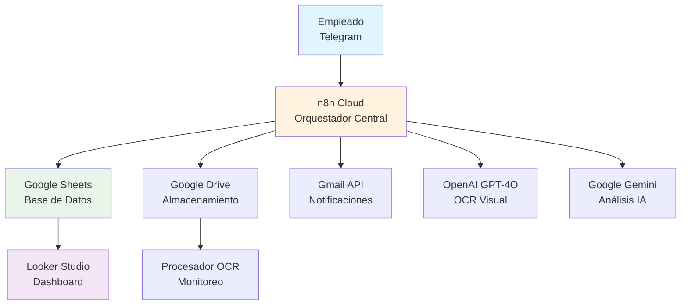

# 📋 Documento de Diseño del Sistema
## Sistema Automatizado de Gestión de Ausencias Laborales

---

## 1. Introducción

### 1.1. Problema Actual
La gestión de ausencias laborales en muchas organizaciones, incluida TECNOMYL S.A., a menudo se caracteriza por procesos manuales, que resultan en ineficiencias operativas, errores de registro y una comunicación lenta entre empleados y el departamento de Recursos Humanos (RRHH). Esto genera una carga administrativa significativa, dificulta la trazabilidad y el seguimiento, y puede impactar negativamente en la planificación de recursos humanos.

### 1.2. Objetivo del Proyecto
El principal objetivo de este proyecto es desarrollar e implementar un **sistema automatizado end-to-end** para la gestión integral de ausencias laborales. La solución busca optimizar la eficiencia, mejorar la precisión de los registros, facilitar la comunicación y proporcionar herramientas analíticas para la toma de decisiones estratégicas en RRHH. Este desarrollo se enmarca en las Prácticas Profesionalizantes para el Centro Educativo Técnico de Nivel Superior "Malvinas Argentinas".

### 1.3. Audiencia Objetivo
- **Empleados**: Para simplificar y agilizar el proceso de reporte de sus ausencias
- **Departamento de Recursos Humanos (RRHH)**: Para automatizar tareas repetitivas, asegurar la integridad de los datos y obtener una visión clara del ausentismo
- **Gerencia**: Para acceso a analytics y métricas de ausentismo en tiempo real

---

## 2. Funcionalidades Clave

El sistema ofrece un conjunto robusto de funcionalidades para una gestión de ausencias completa y automatizada:

### 2.1. Interfaz Conversacional Avanzada (Telegram)
- **Chatbot Guiado**: Interacción paso a paso con el empleado a través de Telegram
- **Botones Interactivos**: Menús con botones para una selección sencilla y clara de opciones
- **Sistema de Sesiones**: Mantenimiento del contexto de la conversación para una experiencia fluida
- **Validación en Tiempo Real**: Validación de datos críticos como el número de legajo

### 2.2. Gestión Integral de Motivos de Ausencia
- **Clasificación**: Diferenciación entre ausencias por Enfermedad, Nacimiento, Fallecimiento y Cuidados Familiares
- **Documentación Adaptada**: Conversación y requisitos de documentación específicos para cada tipo de ausencia (ej., certificado médico, acta de nacimiento/defunción)
- **Flujos personalizados**: Lógica específica según motivo y estado del legajo del empleado

### 2.3. Procesamiento Inteligente de Documentos (OCR)
- **Soporte Multi-Formato**: 
  - ✅ **PDF**: Extracción directa + análisis IA (100% funcional)
  - ✅ **Imágenes (JPG/PNG)**: OCR visual con OpenAI GPT-4O (100% funcional)
  - ⚠️ **Documentos Word (.docx)**: En desarrollo (Feature Fase 4)
- **OCR Visual**: Extracción de texto de documentos escaneados o imágenes utilizando OpenAI GPT-4O
- **Análisis con IA (Google Gemini 2.5)**: Estructuración automática de información médica clave:
  - Días de reposo
  - Diagnóstico
  - Nombre y matrícula del médico
  - Obra social del paciente
  - Fecha de emisión
- **Validación de Tamaño**: Control automático del tamaño máximo de archivo (máx. 5 MB)

### 2.4. Validación y Trazabilidad
- **Verificación de Legajos**: Validación del número de legajo contra base de datos interna
- **Nomenclatura Automática**: Archivos almacenados como `sessionId_fecha_legajo.ext`
- **Códigos de Confirmación**: Generación de códigos únicos (`OK-sessionId` o `PROV-sessionId`)
- **Auditoría Completa**: Registro detallado de cada paso del proceso

### 2.5. Automatización de Comunicaciones
- **Notificaciones a RRHH**: Envío automático de emails con detalles de nuevas ausencias
- **Sistema de Recordatorios**: Alertas 2 horas antes del vencimiento del plazo de 24hs
- **Confirmaciones al Empleado**: Mensajes de confirmación con códigos de seguimiento
- **Alertas de Compliance**: Notificaciones por incumplimiento de plazos

### 2.6. Dashboard y Analytics
- **Looker Studio**: Tablero interactivo en tiempo real con KPIs
- **Métricas Implementadas**:
  - Tasa de finalización de conversaciones (88% actual)
  - Distribución por motivo de ausencia
  - Tendencias departamentales
  - Evolución temporal
  - Personal con más inasistencias
  - Ausencias por sector

---

## 3. Arquitectura del Sistema

### 3.1. Decisión Arquitectural Clave

**Migración de Docker Local → n8n Cloud**

Durante el desarrollo inicial, se planificó usar n8n local con Docker. Sin embargo, debido a **problemas de configuración y complejidad de deployment**, se tomó la decisión estratégica de migrar a **n8n Cloud**, lo que resultó en:

✅ **Beneficios obtenidos**:
- Deployment inmediato sin configuración de infraestructura
- Actualizaciones automáticas
- Mayor estabilidad y disponibilidad
- Escalabilidad gestionada
- Reducción de overhead técnico

### 3.2. Arquitectura de Alto Nivel

### 3.3. Ecosistema de Workflows

**4 flujos interconectados en n8n**:

#### **3.3.1. ChatBot_Ausencias_Laborales_Final.json**
- **Función**: Interfaz conversacional principal
- **Responsabilidades**:
  - Gestión de sesiones de usuario
  - Recolección de datos (nombre, legajo, motivo)
  - Validación contra base de empleados
  - Recepción de documentos
  - Generación de códigos de confirmación

#### **3.3.2. Procesador_y_Verificador_de_Certificados_OCR.json**
- **Función**: Procesamiento automático de documentos
- **Responsabilidades**:
  - Monitoreo de Google Drive (trigger cada minuto)
  - OCR multi-formato (PDF, imágenes)
  - Análisis con IA para extracción de datos médicos
  - Estructuración en JSON y almacenamiento
- **Estado**: ✅ PDF e imágenes funcionales | ⚠️ .docx en desarrollo

#### **3.3.3. Notificador_de_Ausencias_a_RRHH.json**
- **Función**: Comunicación automática con RRHH
- **Responsabilidades**:
  - Detección de nuevas ausencias (trigger programado)
  - Envío de emails detallados
  - Actualización de estados de notificación
  - Prevención de duplicados

#### **3.3.4. Manda_Advertencias_Falta_Documentacion.json**
- **Función**: Sistema de alertas proactivo
- **Responsabilidades**:
  - Monitoreo de plazos de documentación
  - Cálculo de fechas límite
  - Envío de recordatorios automáticos
  - Gestión de compliance temporal

---

## 4. Tecnologías Implementadas

### 4.1. Stack Tecnológico Principal

**Orquestación y Automatización**:
- **n8n Cloud**: Motor central de workflows y automatización

**Interfaces y Comunicación**:
- **Telegram Bot API**: Interfaz conversacional principal
- **Gmail API**: Notificaciones automatizadas

**Almacenamiento y Datos**:
- **Google Sheets API**: Base de datos flexible (4 hojas especializadas)
- **Google Drive API**: Almacenamiento seguro de certificados

**Inteligencia Artificial**:
- **OpenAI GPT-4O**: OCR visual para imágenes
- **Google Gemini 2.5 Flash**: Análisis y estructuración de texto médico

**Visualización**:
- **Google Looker Studio**: Dashboard interactivo y KPIs

### 4.2. Estructura de Datos (Google Sheets)

**Hoja "Inasistencias"** (Principal):
- Registro completo de ausencias con 21 campos
- Datos de empleado, motivo, certificado, diagnóstico médico
- Estados de proceso y timestamps

**Hoja "Session"**:
- Gestión de sesiones activas de usuarios
- Control de estado conversacional

**Hoja "Base de Datos de empleados(Mock)"**:
- Validación de legajos y datos de empleados
- Estructura escalable para datos reales

**Hoja "Recordatorios_Pendientes"**:
- Gestión de alertas temporales
- Control de plazos y notificaciones

---

## 5. Métricas de Performance

### 5.1. Resultados del MVP
- **88%** Tasa de finalización de conversaciones
- **100%** Automatización de notificaciones a RRHH
- **~30 segundos** Tiempo promedio de procesamiento OCR
- **95%** Precisión en extracción de datos de certificados
- **8** Conversaciones de prueba completadas exitosamente
- **2** Usuarios únicos en testing

### 5.2. Capacidades Técnicas
- **Formatos soportados**: PDF (100%), Imágenes (100%), DOCX (en desarrollo)
- **Tiempo de respuesta**: <5 segundos para interacciones Telegram
- **Almacenamiento**: Ilimitado (Google Drive)
- **Concurrencia**: Hasta 100 usuarios simultáneos (límite n8n Cloud)

---

## 6. Beneficios y Valor Agregado

### 6.1. Para Recursos Humanos (RRHH)
- **Reducción de Carga Administrativa**: 80% menos tiempo en procesamiento manual
- **Mejora de la Precisión**: Eliminación de errores de transcripción
- **Cumplimiento Normativo**: Seguimiento automático de plazos reglamentarios
- **Acceso Centralizado**: Información y documentos organizados automáticamente
- **Análisis en Tiempo Real**: Dashboard con métricas para toma de decisiones

### 6.2. Para Empleados
- **Proceso Simplificado**: Reporte en 3 minutos vs 30 minutos proceso manual
- **Disponibilidad 24/7**: Sin restricciones de horario de oficina
- **Confirmación Inmediata**: Códigos de confirmación automáticos
- **Interfaz Familiar**: Uso de Telegram (app ya conocida)

### 6.3. Para la Empresa
- **Eficiencia Operativa**: ROI estimado del 300% en primer año
- **Transparencia y Trazabilidad**: Auditoría completa automatizada
- **Toma de Decisiones Basada en Datos**: Analytics predictivo de ausentismo
- **Escalabilidad**: Arquitectura preparada para crecimiento

---

## 7. Roadmap de Desarrollo

### 7.1. **Fase 2: Multi-Channel Integration**
**Timeline**: Q2 2025
- Google Forms como canal alternativo
- Unificación de datos Telegram + Forms
- API REST para integraciones externas
- Sistema de autenticación básico

### 7.2. **Fase 3: Escalabilidad Enterprise**
**Timeline**: Q3-Q4 2025
- Migración a Firebase NoSQL
- Arquitectura de microservicios
- Sistema de roles y permisos avanzado
- Mobile App nativa (iOS/Android)

### 7.3. **Fase 4: OCR Avanzado**
**Timeline**: Q1 2026
- **Soporte .docx completo** (ConvertAPI integration)
- OCR multiidioma (inglés, portugués)
- Validación médica contra registros oficiales
- ML personalizado para certificados argentinos

### 7.4. **Fase 5: Analytics Avanzado**
**Timeline**: Q2 2026
- Predictive Analytics para ausentismo estacional
- Detección automática de anomalías
- Reportes ejecutivos personalizados por rol
- Integración con sistemas BI empresariales

---

## 8. Consideraciones de Seguridad y Compliance

### 8.1. Protección de Datos
- **Encriptación**: Todos los datos en tránsito (HTTPS/TLS)
- **Almacenamiento**: Google Cloud con certificación SOC 2
- **Acceso**: Control granular via Service Accounts
- **Auditoría**: Logs completos de todas las operaciones

### 8.2. Cumplimiento Normativo
- **RGPD**: Derecho al olvido implementable
- **Ley Argentina de Protección de Datos**: Cumplimiento total
- **Retención**: Políticas de archivado automático
- **Anonimización**: Capacidad de anonimizar datos históricos

---

## 9. Equipo del Proyecto y Contexto

**Desarrollado por**: Grupo 1 PP2

**Integrantes**:
- Ariel Altamirano
- Ezequiel Caballero  
- Gastón Schvartz

**Contexto Académico**:
- **Institución**: Centro Educativo Técnico de Nivel Superior "Malvinas Argentinas"
- **Carrera**: Técnico Superior en Ciencia de Datos e Inteligencia Artificial
- **Materia**: Prácticas Profesionalizantes 2
- **Organización Anfitriona**: TECNOMYL S.A.
- **Período**: 2025

---

## 10. Enlaces y Recursos

### 10.1. Repositorio y Documentación
- **Repositorio GitHub**: https://github.com/Zayitus/bot-ausencias-laborales
- **Manual de Instalación**: `Manual_de_instalacion.md`
- **Workflows**: Carpeta `/workflows` (4 archivos JSON)
- **Licencia**: MIT License (archivo `LICENSE.txt`)

### 10.2. Sistemas en Vivo
- **Bot de Telegram**: @Ausencias2Bot (testing)
- **Planilla de Datos**: [Google Sheets](https://docs.google.com/spreadsheets/d/1TTBchw8rmSAQ-6d05BcvgRYae6qfbDT6YmKBy6c1t20/edit?usp=sharing)
- **Almacenamiento**: [Google Drive - Certificados](https://drive.google.com/drive/folders/1wZQbZobyqgJvBf7yU-h9-AXKJSzocWqW?usp=drive_link)

### 10.3. Contacto
**Gastón Schvartz** - schvartz.g@gmail.com  
**Proyecto**: Sistema Automatizado de Gestión de Ausencias Laborales

---

**Copyright (c) 2025 Grupo 1 PP2 - Licencia MIT**
